<!--
  Description: Professional Portfolio Gateway Markdown Template
  Author: Kyler Hanson
  Date: May 4, 2026
  GitHub: https://github.com/kyhans07
-->

# 🌐 Professional Portfolio Gateway

Welcome to my central project hub. This document serves as a directory for my work in Web Systems Analysis, showcasing full-stack development, and database management.

---

## 📊 Project Directory

| Repository | Primary Tech | Category |
| :--- | :--- | :--- |
| [🎥 Movie Rater](#movie-rater) | JavaScript / CSS | CSC465 Advanced Web Development |
| [⚾ MLB Player Search](#mlb-player-search) | Node.js / Express | CSC465 Advanced Web Development |
| [🔥 Thermal Guessing Game](#thermal-guessing-game) | JavaScript / Logic | CSC465 Advanced Web Development |
| [🧢 Baseball FAQ](#baseball-faq) | JavaScript / DOM | CSC465 Advanced Web Development |
| [🗂️ Flashcard App](#flashcard-app) | JavaScript / DOM | CSC465 Advanced Web Development |
| [📈 Retirement Projector](#retirement-projector) | JavaScript | CSC465 Advanced Web Development |
| [🏢 NENTEC Database](#nentec-database) | SQL / Node.js | Seminar Group |

---

## 🎥 Movie Tracker

### 📝 Summary
A dynamic application focused on cinematic tracking. Originally conceived as a task manager, this project was pivoted to a movie rating system to demonstrate adaptability in project requirements and precise design control.
*   **Visual Preview:** 
    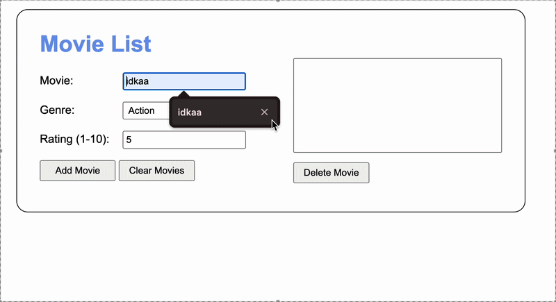
*   **Tech Stack:**   
*   **Key Learning Concepts:** State management, scope pivoting, and standard CSS layout control.
*   **Status:** ✅ Completed
*   **Type:** Course Project (Instructor: Debbie Johnson)
*   **Lessons Learned:** Local Storage is much harder than using a database.

[**Explore Repository ↗**](https://github.com/kyhans07/ch11-12-13-movie-tracker)

[TOP ↑](#-project-directory)

---

## ⚾ MLB Player Search

### 📝 Summary
A full-stack integration that pulls live statistics from the MLB API. This project highlights a professional layered architecture and the ability to handle complex external datasets.

*   **Visual Preview:** 
    | Star Players | Search Results |
    | :---: | :---: |
    | 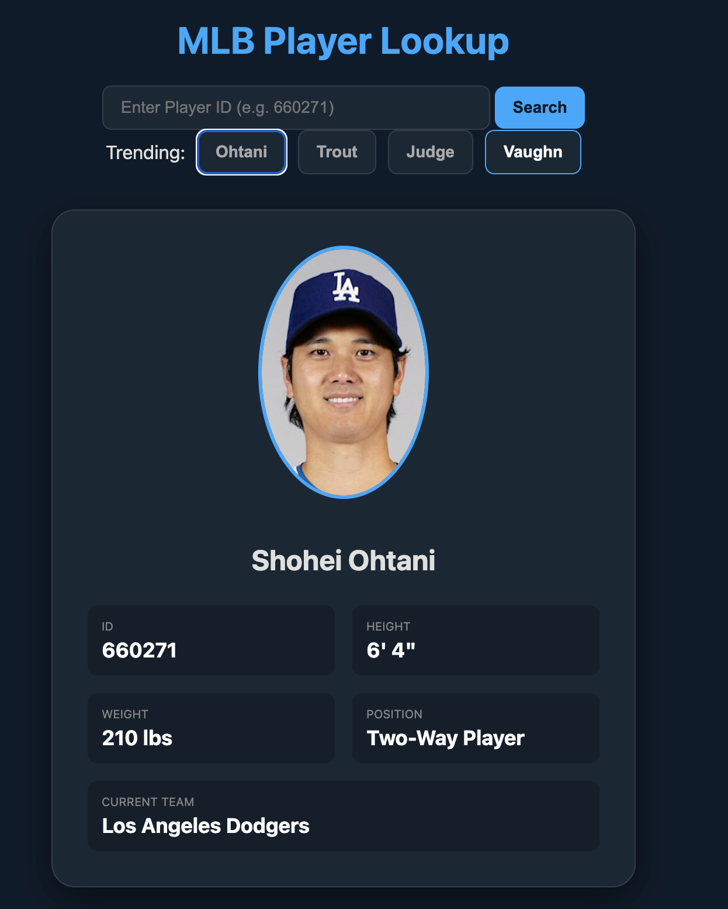 | 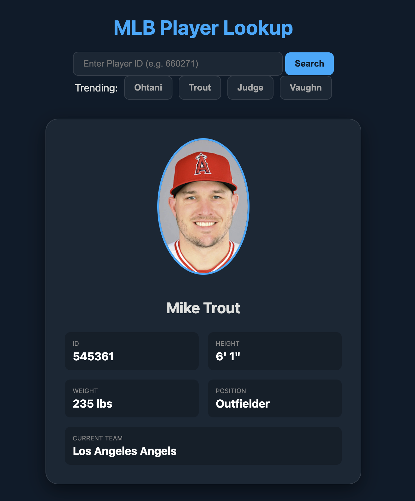 |
*   **Tech Stack:**   
*   **Key Learning Concepts:** REST API integration, asynchronous middleware, and client-server separation.
*   **Status:** ✅ Completed
*   **Type:** Course Project (Instructor: Debbie Johnson)
*   **Lessons Learned:** Not every FREE API has current data.

[**Explore Repository ↗**](https://github.com/kyhans07/MLB_API)

[TOP ↑](#-project-directory)

---

## 🔥 Thermal Guessing Game

### 📝 Summary
A web-based logic game that provides real-time "thermal" feedback based on a user's proximity to a hidden number. It includes a robust history log and dynamic "Best Score" tracking using session persistence.

*   **Visual Preview:** 
    | Round History | Win State |
    | :---: | :---: |
    | 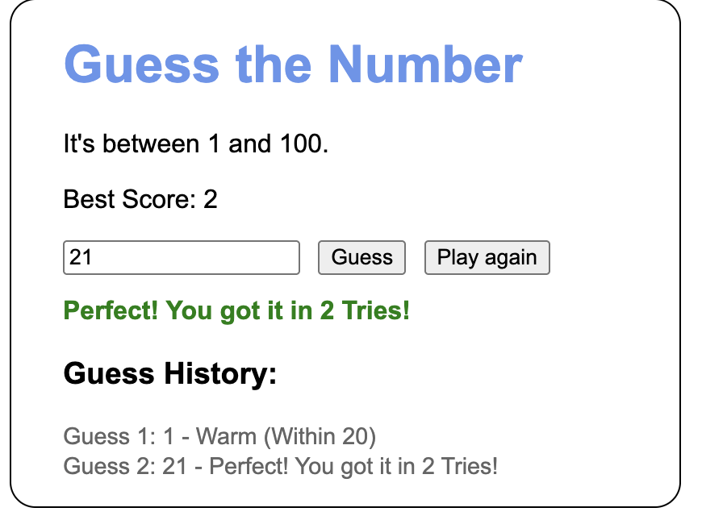 | 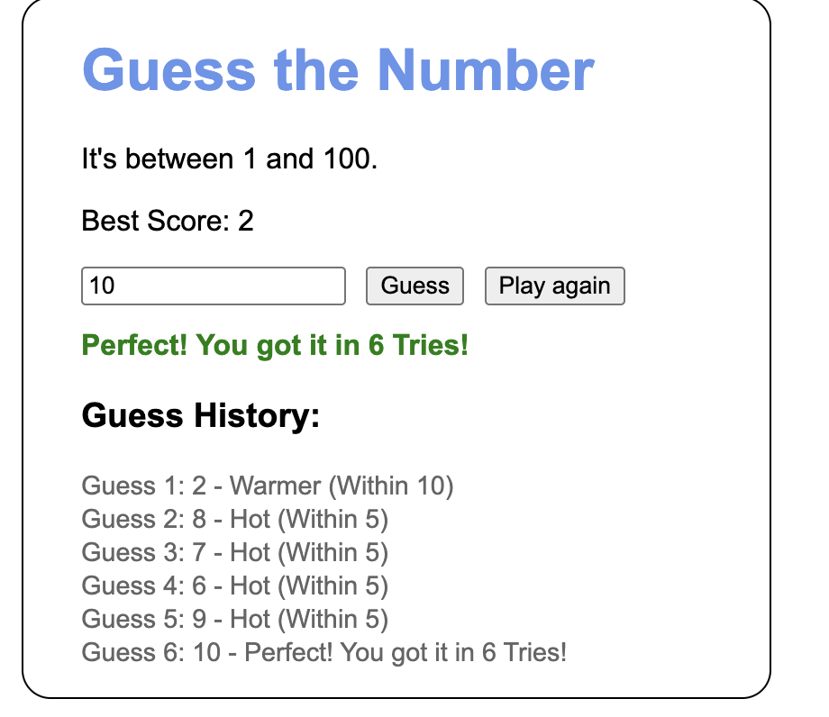 |
*   **Tech Stack:**  
*   **Key Learning Concepts:** Mathematical absolute distance logic (`Math.abs`), keyboard event listening (Enter key support), and tracking high scores across sessions.
*   **Status:** ✅ Completed
*   **Type:** Course Project (Instructor: Debbie Johnson)
*   **Lessons Learned:** Make sure the correct answer equals the new rounded answer

[**Explore Repository ↗**](https://github.com/kyhans07/Ch5-Assignment-Hot-Cold-)

[TOP ↑](#-project-directory)

---

## 🧢 Baseball FAQ

### 📝 Summary
An interactive, dynamic FAQ page that utilizes an accordion-style interface. This project features high-level DOM manipulation where clicking a question updates a primary feature image via data attributes.

*   **Visual Preview:** 
    | Default | "BB" Rule | "Cycle" Rule |
    | :---: | :---: | :---: |
    | 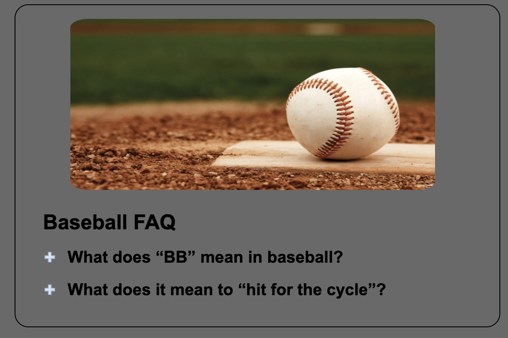 | 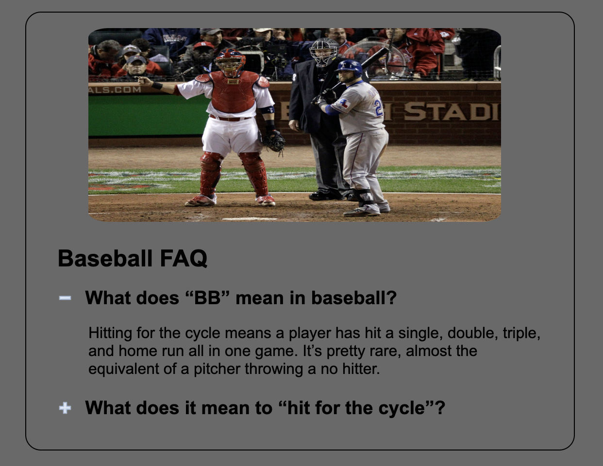 | 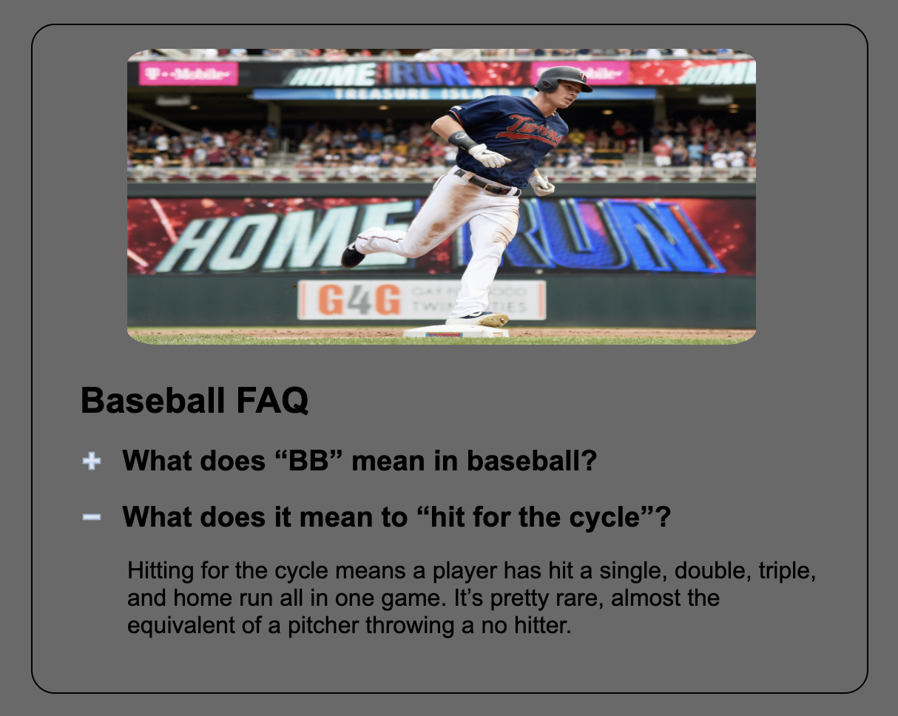 |
*   **Tech Stack:**  
*   **Key Learning Concepts:** Accordion logic (exclusive focus), `data-img` attribute handling, and auto-reset image logic.
*   **Status:** ✅ Completed
*   **Type:** Course Project (Instructor: Debbie Johnson)
*   **Lessons Learned:** querySelector isn't always for all

[**Explore Repository ↗**](https://github.com/kyhans07/Smartwatch-FAQ-)

[TOP ↑](#-project-directory)

---

## 🗂️ Flashcard App

### 📝 Summary
A web-based study tool designed for managing digital flashcards. Features rigorous data validation, automatic text formatting, and a state-based quiz mode for interactive learning.

*   **Visual Preview:** 
    | Add Card | List View | Quiz Mode | Clear Data | Default Loader |
    | :---: | :---: | :---: | :---: | :---: |
    | 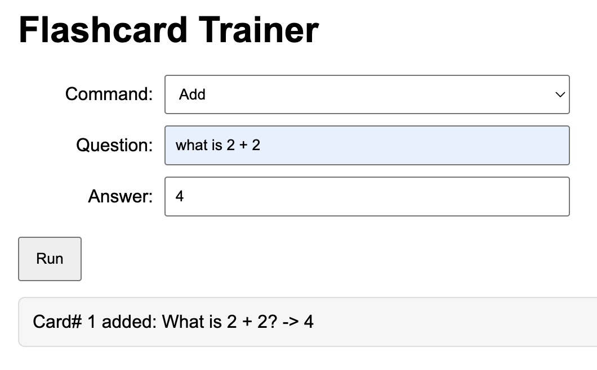 | 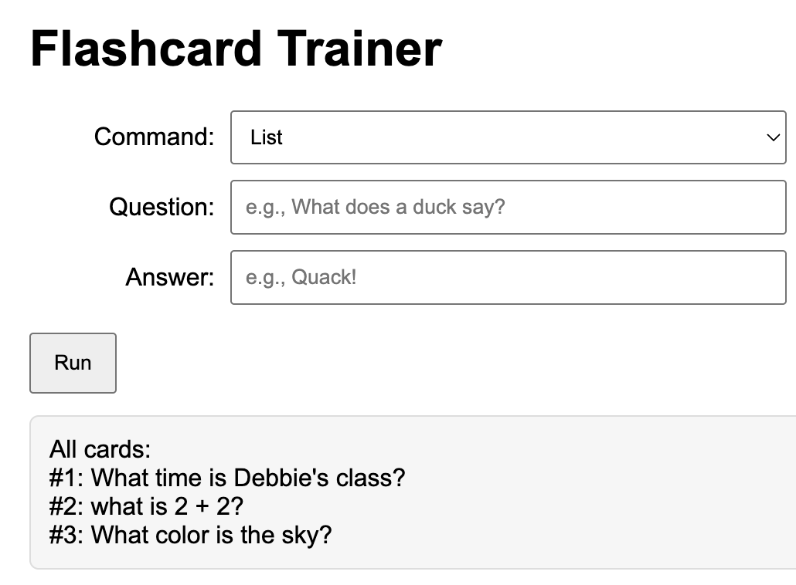 | 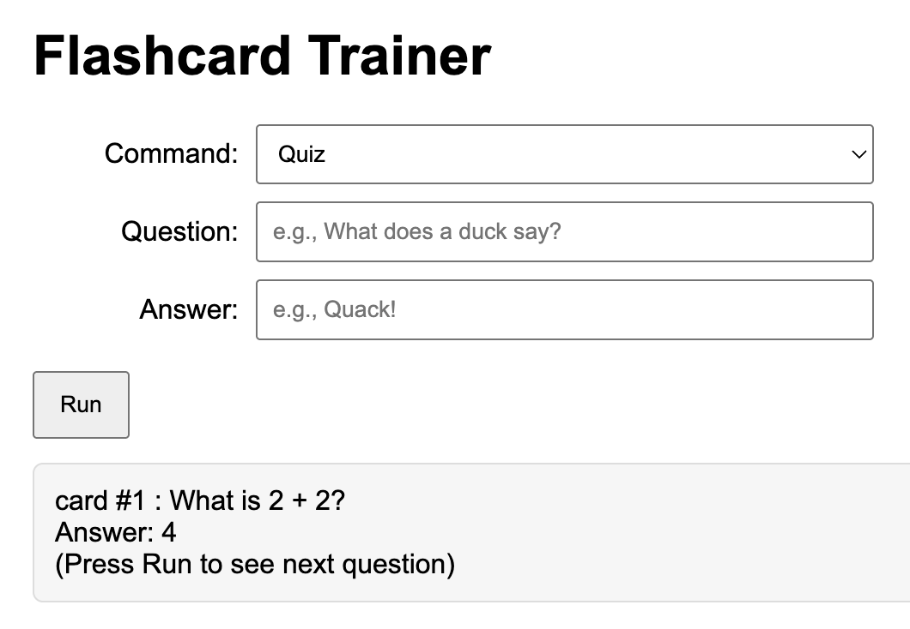 | 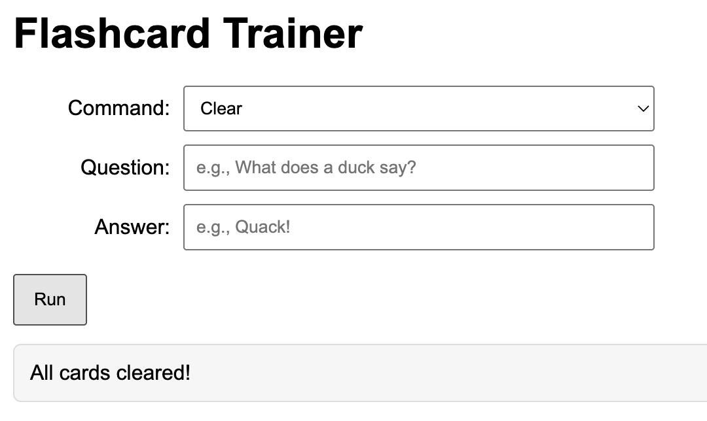 | 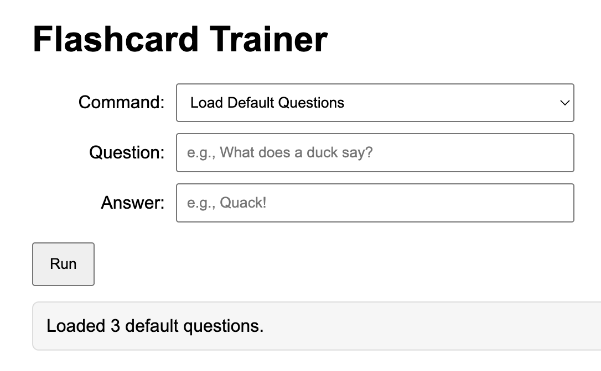 |
*   **Tech Stack:**  
*   **Key Learning Concepts:** Event handling with `preventDefault()`, block-scoping, and iterating through arrays with `for...in` loops.
*   **Status:** ✅ Completed
*   **Type:** Course Project (Instructor: Debbie Johnson)
*   **Lessons Learned:** Don't make array names the same as a variable

[**Explore Repository ↗**](https://github.com/kyhans07/Chapter-3-4-assignment)

[TOP ↑](#-project-directory)

---

## 📈 Retirement Projector

### 📝 Summary
A financial utility that calculates and visualizes live yearly projections. It uses client-side logic to provide immediate feedback on retirement goals.

*   **Visual Preview:** 
    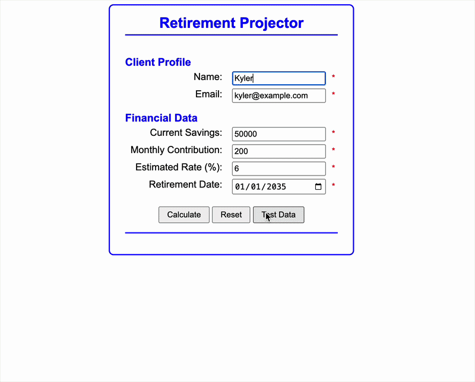
*   **Tech Stack:**  
*   **Key Learning Concepts:** Data persistence via Local Storage and mathematical modeling in JS.
*   **Status:** ✅ Completed
*   **Type:** Course Project (Instructor: Debbie Johnson)
*   **Lessons Learned:** 5 is milliseconds not 5 seconds 

[**Explore Repository ↗**](https://github.com/kyhans07/Retirement-Countdown-ch8-9)

[TOP ↑](#-project-directory)

---

## 🏢 NENTEC Database

### 📝 Summary
A 23-hour comprehensive development lifecycle project for a sports recreation center. Documents the journey from wireframes and ERDs to a functional database system.

*   **Visual Preview:** 
    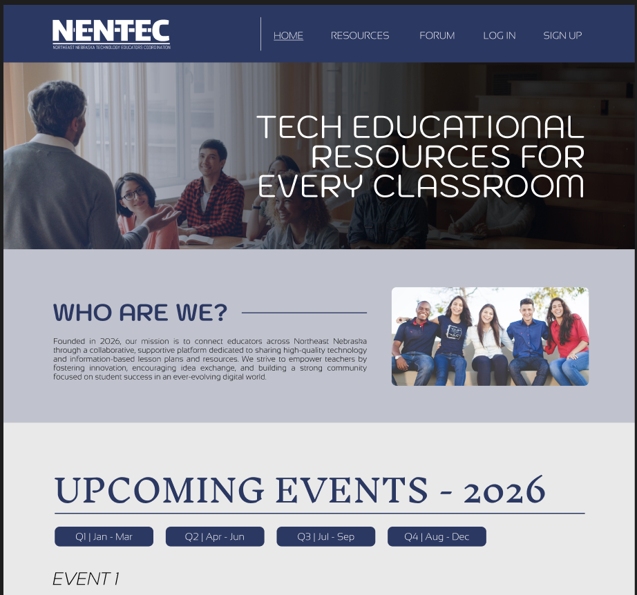
*   **Tech Stack:**  
*   **Key Learning Concepts:** Database schema design, CRUD operations, and full-cycle project documentation.
*   **Status:** ✅ Completed
*   **Type:** Group Semester Project
*   **Lessons Learned:** Don't forget your AWS credentials causing you to recreate an entire database 👍

[**Explore Repository ↗**](https://github.com/kyhans07/SeminarGroupProject)

[TOP ↑](#-project-directory)

---

## 📁 Standard Repository Structure

To maintain professional standards, all repositories linked above are organized as follows:

*   📂 **`/assets`**: Screenshots, GIFs, and visual aids.

---
*Created by Kyler Hanson - Web Systems Analysis Portfolio*
